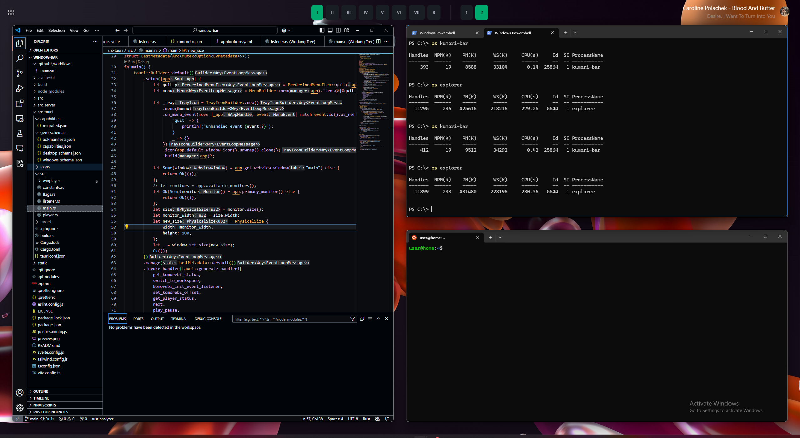

# kumori-bar
A simple status bar, designed to be used with the [Komorebi tiling window manager](https://lgug2z.github.io/komorebi/index.html).

> [!WARNING]  
> Still WIP, use at your own risk.

Thanks to developers of [Zebar](https://github.com/glzr-io/zebar) and [yasb](https://github.com/da-rth/yasb/tree/tauri-port) for making the navigation of the Komorebi api and Tauri much easier.



## Getting started / Download
- Currently, you need to build from source.

## Features

- Displays the current workspace on all monitors.
No other widgets, yet.

## Developing

### Dependencies
1. Follow the [Tauri guide](https://tauri.app/v1/guides/getting-started/prerequisites) to download the required build tools.
2. Remember to run `npm i` after.

Use `npm run tauri dev` to start up the dev server.

Uses the following software/libraries:
- [Tauri](https://tauri.app/)
- [SvelteKit](https://kit.svelte.dev/)
- [Tailwind](https://tailwindcss.com/)
- [DaisyUI](https://daisyui.com/)


### Building

To create a production version of your app:

```bash
npm run tauri build
```

## Contribution

- Contributions are welcome. 
- If you want to add a bunch of new features, consider making a fork. The codebase is fairly small.
